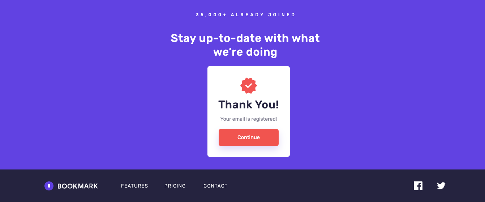

# Bookmark Landing Page


This repository contains the solution to the [Bookmark Landing Page challenge](https://www.frontendmentor.io/challenges/bookmark-landing-page-5d0b588a9edda32581d29158) from Frontend Mentor. The challenge involves creating a landing page that closely matches the provided design, with specific interactive elements.

## Live Site

You can view the live site [here](https://victorkevz.github.io/bookmark-homepage/).

## Features

- Responsive design that adapts to different screen sizes.
- Hover and focus states for all interactive elements.
- Error messages for the newsletter form:
  - If the input field is empty.
  - If the email address is not formatted correctly.
- Added a feedback pop-up message upon successful form submission for an improved user experience.
- JavaScript functionalities:
  - Tabbed features section.
  - FAQ accordion where each question can be toggled independently.

## Technologies Used

- HTML5
- CSS
- React JS
- Vite

## Installation

1. Clone the repository:
   ```bash
   git clone https://github.com/VictorKevz/bookmark-homepage.git
   ```
2. Navigate to the project directory:
   ```bash
   cd bookmark-homepage
   ```
3. Install the dependencies:
   ```bash
   npm install
   ```
4. Start the development server:
   ```bash
   npm run dev
   ```

## Usage

Open your browser and navigate to `http://localhost:3000` to view the landing page.

## Contributing

If you have any suggestions or improvements, feel free to open an issue or create a pull request.


This README provides a concise overview of the project, including key features, technologies used, and instructions for installation and usage. For any further details, please refer to the project repository or the challenge page.